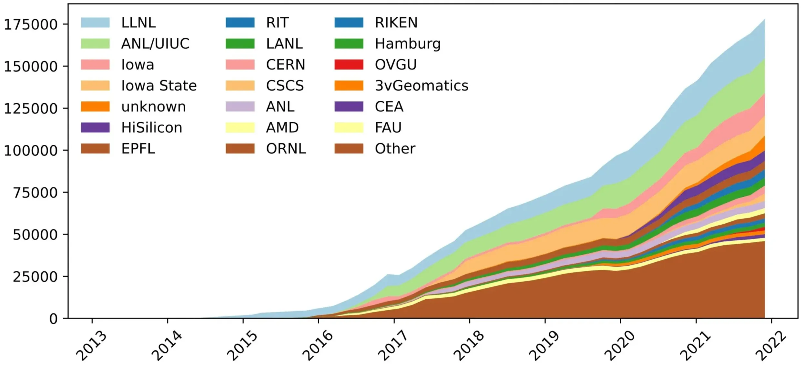
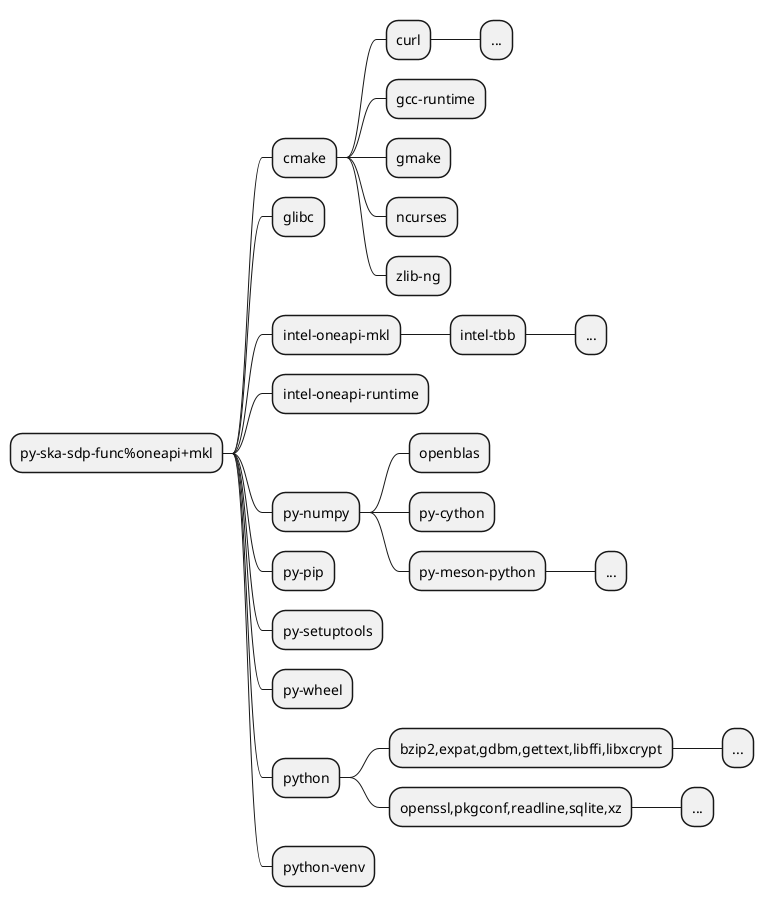

  <h2>The package manager for HPC</h2>

  

    <ul class="list-disc list-inside text-sm mt-4">
        <li class="mb-2">One of the most obvious solutions by/for HPC community.</li>
        <li class="mb-2">Support combinatorics of versions, configurations, platforms, Release/Debug, etc.</li>
        <li class="mb-1">Another nested point</li>
        <li class="mb-1">There are 
            <a href="https://hepsoftwarefoundation.org/notes/HSF-TN-2016-03.pdf" target="_blank">contenders</a>:
        </li>
        <ul class="text-sm list-inside ml-4">
            <li><code>Nix/Guix</code>, <code>Conda</code>, <code>EasyBuild</code>, <code>Gentoo Prefix</code>, ...</li>
        </ul>
    </ul>
    <figure class="mt-4">
      
      <figcaption class="text-center text-[6px] mb-2">
        Credit: 
        <a href="https://computing.llnl.gov/projects/spack-hpc-package-manager" target="_blank">
            Lawrence Livermore National Laboratory
        </a>
      </figcaption>
    </figure>
  

  

  

  

