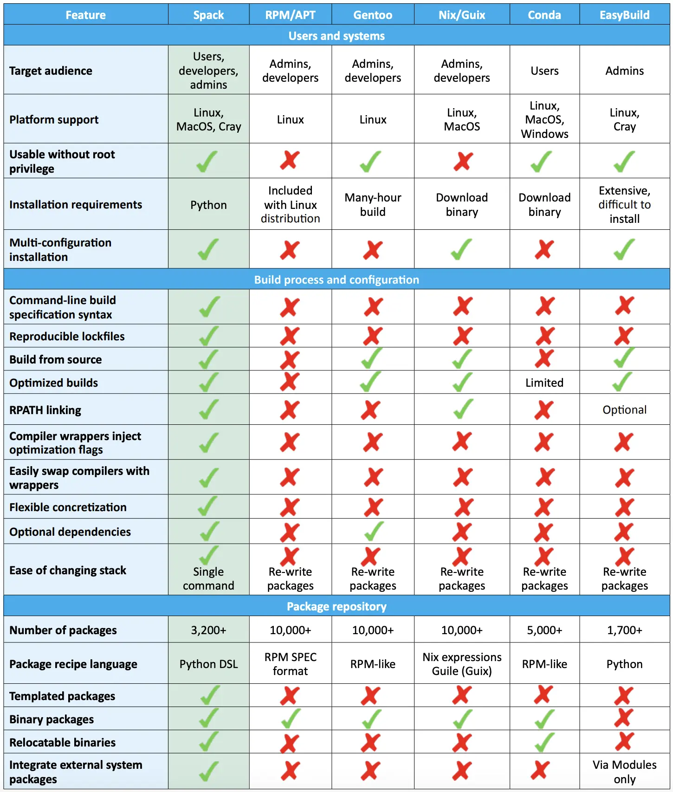

  <h2>The package manager for HPC</h2>

  

    <v-clicks><ul class="list-disc list-inside text-sm mt-4">
        <li class="mb-2">Installation is more than just a name and version.
        <ul style="font-size:10px;">
            <li>Which compiler suite was used?</li>
            <li>Which architecture was it built for?</li>
            <li>Which flags were used?</li>
            <li>Which falvour of a dependency was used?</li>
        </ul>
        </li>
        <li class="mb-2">We may often need to install multiple variants of the same package.</li>
        <li class="mb-2">HPC violates many of the assumptions made by package managers.
            <ul style="font-size:10px;">
                <li>Portable binaries (bad for performance, use of system optimized libs) </li>
                <li>Same toolchain across the ecosystem (multiple languages).</li>
                <li>Binary and source code are 1-to-1 (good for reproducibility, bad for performance, multiple variants).</li>
            </ul>
        </li>
        <li class="mb-2">One of the most obvious solutions by/for HPC community.</li>
        <li class="mb-2">Support combinatorics of versions, configurations, platforms, Release/Debug, etc.</li>
        <li class="mb-1">There are other 
            <a href="https://hepsoftwarefoundation.org/notes/HSF-TN-2016-03.pdf" target="_blank">solutions</a>:
            <ul class="list-inside ml-4">
                <li style="font-size:10px;"><code>Nix/Guix</code>,<code>Conda</code>,<code>Gentoo Prefix</code>,<code>EasyBuild</code></li>
            </ul>
        </li>
    </ul></v-clicks>
  

  

   <figure v-after class="w-4/5 ml-auto">
      
      <figcaption class="text-center text-[9px] mb-2">
        Spack compared to other package managers. Credit: 
        <a href="https://spack.io/files/spack-rd100-2019-final-with-letters.pdf" target="_blank">
            Lawrence Livermore National Laboratory
        </a>
      </figcaption>
    </figure>
  

  

