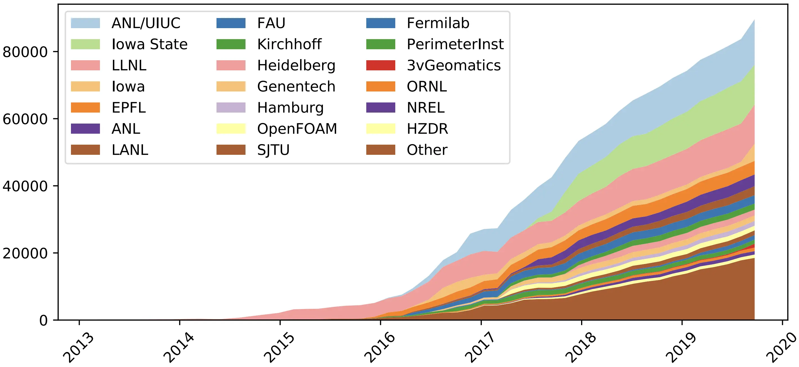

  

    

        <li class="mb-2">Prototyped by <a href="https://people.llnl.gov/gamblin2" target="_blank">Todd Gamblin</a> at LLNL in 2013.</li>
        <li v-click class="mb-2">Intuitive way of managing packages, the brute force method!
            <li style="font-size: 11px;"><a href="https://www.energy.gov/articles/rd-world-magazine-announces-2019-rd-100-winners" target="_blank">2019 R&D 100 winner</a>.</li>
        </li>
        <li v-click class="mb-2">Diverse community of developers and users.
                <li style="font-size: 11px;">Backed by HPC centers around the world, US national labs and DoE.</li>
        </li>
    

   <figure v-after class="mt-auto">
      
      <figcaption class="text-center text-[9px] mb-2">
        Distribution of 5000 active monthly users as of 2020. Credit: 
        <a href="https://news.fnal.gov/2019/12/fermilab-contributes-to-award-winning-spack-software-tool/" target="_blank">
            Fermilab
        </a>
       </figcaption>
    </figure>
  

  

    

    <figure class="mt-auto">
      
      <figcaption class="text-center text-[9px] mb-2">
        Contributions (lines of code) over time in core by organizations. Credit: 
        <a href="https://computing.llnl.gov/projects/spack-hpc-package-manager" target="_blank">
            Lawrence Livermore National Laboratory
        </a>
       </figcaption>
    </figure>
    

   <figure class="mt-auto">
      
      <figcaption class="text-center text-[9px] mb-2">
        Contributions (lines of code) over time in packages by organizations. Credit: 
        <a href="https://spack.io/files/spack-rd100-2019-final-with-letters.pdf" target="_blank">
            Lawrence Livermore National Laboratory
        </a>
      </figcaption>
    </figure>
    

    

  

