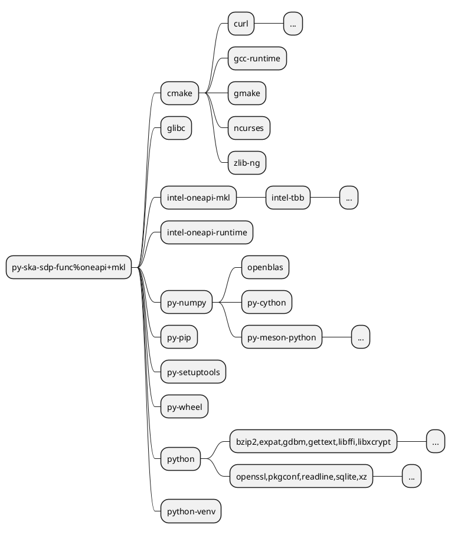

<h1 text-center> There are no "Packages", There are Hashes!</h1>

  

    <ul>
    <li>Identify each installation with a hash.
        <ul style="font-size: 11px;">
            <li>Package Specifications: name, version, and variant settings (e.g., +mpi or ~debug).</li>
            <li>Dependency Graph: include all transitive dependencies (direct and indirect)</li>
            <li>Compiler Information: GCC 14.2.0, GCC 14.2.1, Clang, Intel, ...</li>
            <li>Compiler Flags: custom CFLAGS, FFLAGS, ...</li>
            <li>Platform Information: x86_64, arm64, ppc64le</li>
            <li>Dependency Packages Hashe: each dependency has it's own hash</li>
            <li>Environment Variables: ENVs that can affect build process, <code>config.yaml</code>, <code>packages.yaml</code>, <code>compilers.yaml</code>, ...</li>
        </ul>
    </li>
    <li v-click>Concretizer uses <a href="https://potassco.org/clingo/" target="_blank">Clingo</a> to resolve the dependency graph.
        <ul style="font-size: 11px;">
            <li>Combinatorial search problem (NP-hard).</li>
            <li>Translate specifications and constraints to a logic program in <a href="https://potassco.org/" target="_blank">ASP</a> (Answer Set Programming).</li>
            <li>20,000-30,000 <a href="https://www.trex-coe.eu/sites/default/files/TREX%20Build-systems%20Hackathon%20-%20Nov%202021/TREX%20-%20Spack%20presentation.pdf" target="_blank">facts</a>
            (dependencies, options), 1000 loc of logic program (constraints, optimization criteria).</li>
            <li>Leverage <a href="https://www.imn.htwk-leipzig.de/~waldmann/etc/untutorial/asp/" taget="_blank">SAT</a> (Satisfiability) solvers to build the DAG (Directed Acyclic Graph).</li>
        </ul>
    </li>
    </ul>
  

  

  

  

