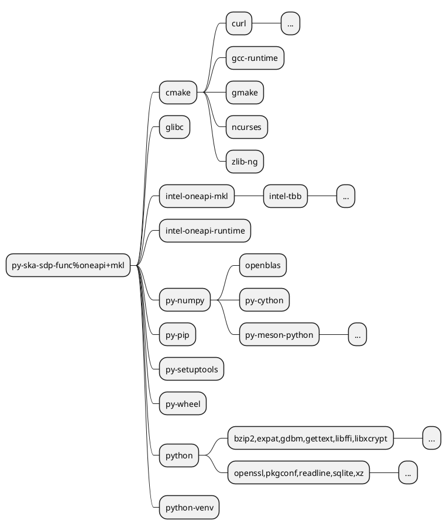

<li>
<a href="https://spack.readthedocs.io/en/latest/getting_started.html" target="_blank">"Installation"</a> is easy:

```bash
git clone -c feature.manyFiles=true --depth=2 https://github.com/spack/spack.git
# source envs for sh/bash/zsh/csh/tcsh/fish
. spack/share/spack/setup-env.fish
```
</li>


```plantuml {theme: 'neutral', scale: 0.7, alt: 'Package managers diagram'}
@startuml

skinparam defaultTextAlignment center

!define ICON_SIZE 48
!$ICONURL = "https://raw.githubusercontent.com/tupadr3/plantuml-icon-font-sprites/v3.0.0/icons"

!include $ICONURL/common.puml
!include $ICONURL/devicons/python.puml
!include $ICONURL/devicons2/pypi.puml
!include $ICONURL/devicons2/cmake.puml
!include $ICONURL/devicons2/spack.puml
!include $ICONURL/devicons2/c.puml
!include $ICONURL/font-awesome-5/user_ninja.puml
!include $ICONURL/font-awesome-5/comment_dots.puml

' Set the overall direction of the diagram
top to bottom direction

' Define the Spack node first
package "Package Manager"{
  DEV2_SPACK(spack, spack, node)
}
' Define groups
package "Build Tool / Package Manager"{
  DEV2_C(meson, Meson, node)
  DEV2_C(bazel, Bazel, node)
  DEV2_CMAKE(cmake, CMake, node)
  DEV2_PYPI(pypi, PyPI, node)
  DEV_PYTHON(poetry, Poetry, node)
  FA5_USER_NINJA(ninja, Ninja, node)
}

' Add connections
spack --> pypi
spack --> cmake
spack --> ninja
spack --> meson
spack --> bazel
spack --> poetry
pypi <-- poetry
cmake <-- meson
ninja <-- meson
ninja <-- cmake
bazel <-- cmake
bazel --> poetry
@enduml
```



```ts {monaco-run}{lineNumbers:'on'}
import { version } from 'vue'
import { emptyArray, sayHello } from './external'

sayHello()
console.log(`vue ${version}`)
console.log(emptyArray<number>(10).reduce(fib => [...fib, fib.at(-1)! + fib.at(-2)!], [1, 1]))
```

```python {monaco-run}{lineNumbers:'on'}
print("Hello from Python!")
x = 10
y = 20
print(f"Sum: {x + y}")
```

<PythonRunner :autoRun=true :showRunButton=true>

import pyproject2spack

from pyproject2spack.parser.pyproject import PyProject

from pyproject2spack.matcher.spack import Spack

from pyproject2spack.renderer.jinja2 import Renderer

print(pyproject2spack.__version__)

gitlab_url = "https://gitlab.com/ska-telescope/sdp/science-pipeline-workflows/ska-sdp-instrumental-calibration"
# parse pyproject.toml file
prj = PyProject(giturl=gitlab_url)
constraints = prj.dependencies()
metadata = prj.metadata()

# match version constraints to that of spack database
matcher = Spack(constraints=constraints)
matches = matcher.match()

# render a template given template variables
renderer = Renderer(matches=matches, metadata=metadata)
renderer.render()

</PythonRunner>

