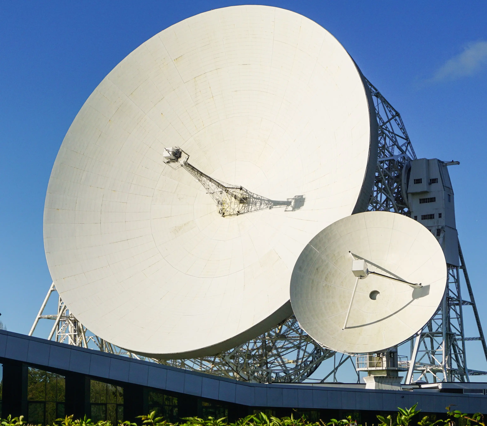

A mini workshop on
# Spack Package Manager

    
        

            Lovell Telescope, Credit: 
            <a href="https://skao.slack.com/archives/C04MHT33SMN/p1699627919247679" target="_blank" style="text-decoration: none !important;">
                Pablo Carrillo
            </a>
        

    </img>

<a href="https://saliei.io/about" target="_blank">
Saeid Aliei
</a>

Software Engineer
 
    <a href="https://skao.int" target="_blank">
        Square Kilomotre Array Observatory (SKAO)
    </a>

  

<!--introduce yourself, the why of workshop, and the content layout-->

---
src: ./pages/01-spack.md
---

---
src: ./pages/02-spack.md
---

---
src: ./pages/03-spack.md
---

---
src: ./pages/04-spack.md
---

---
src: ./pages/05-spack.md
---
